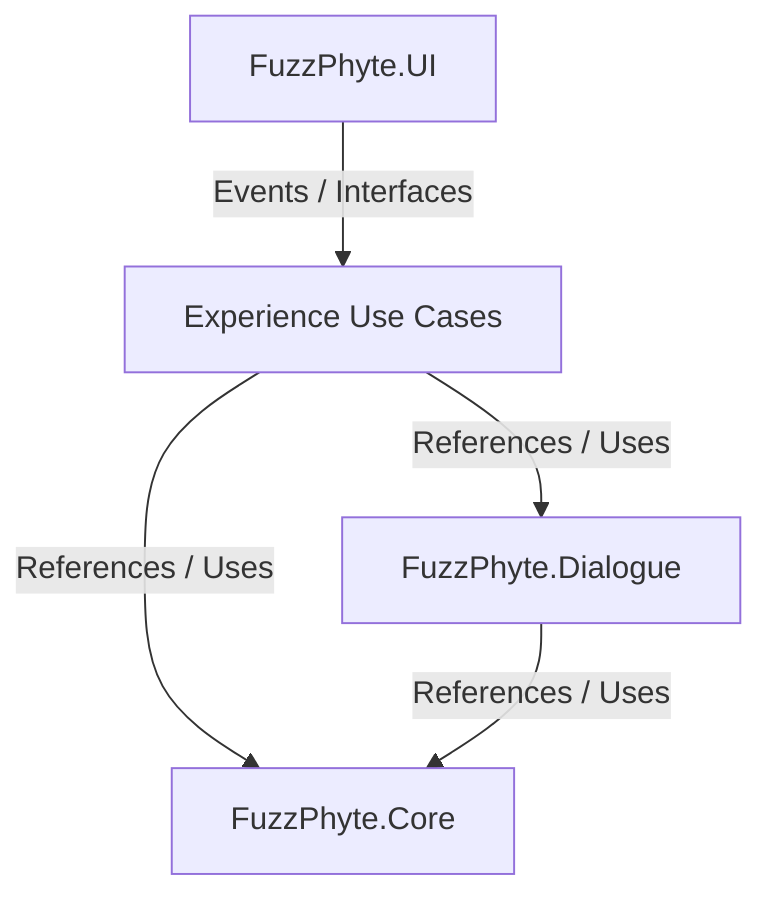

# FuzzPhyte Unity Tools

## User Interface

FP_UI is designed to be a core base class for future UI related work towards Unity's UI Toolkit, UI Elements, and UnityEngine.UI... this package is under development and will drastically change over the 2025 year. Currently this is just one core base class with useful styles and methods for activating/deactivating styles

## Setup & Design

FP_UI is just a base class to be derived from other UI Toolkit classes.

### Software Architecture

## FuzzPhyte Package Dependency Flow

### Ways to Extend

## Dependencies

Please see the [package.json](./package.json) file for more information.

## License Notes

* This software running a dual license
* Most of the work this repository holds is driven by the development process from the team over at Unity3D :heart: to their never ending work on providing fantastic documentation and tutorials that have allowed this to be born into the world.
* I personally feel that software and it's practices should be out in the public domain as often as possible, I also strongly feel that the capitalization of people's free contribution shouldn't be taken advantage of.
  * If you want to use this software to generate a profit for you/business I feel that you should equally 'pay up' and in that theory I support strong copyleft licenses.
  * If you feel that you cannot adhere to the GPLv3 as a business/profit please reach out to me directly as I am willing to listen to your needs and there are other options in how licenses can be drafted for specific use cases, be warned: you probably won't like them :rocket:

### Educational and Research Use MIT Creative Commons

* If you are using this at a Non-Profit and/or are you yourself an educator and want to use this for your classes and for all student use please adhere to the MIT Creative Commons License
* If you are using this back at a research institution for personal research and/or funded research please adhere to the MIT Creative Commons License
  * If the funding line is affiliated with an [SBIR](https://www.sbir.gov) be aware that when/if you transfer this work to a small business that work will have to be moved under the secondary license as mentioned below.

### Commercial and Business Use GPLv3 License

* For commercial/business use please adhere by the GPLv3 License
* Even if you are giving the product away and there is no financial exchange you still must adhere to the GPLv3 License

## Contact

* [John Shull](mailto:JShull@fuzzphyte.com)
