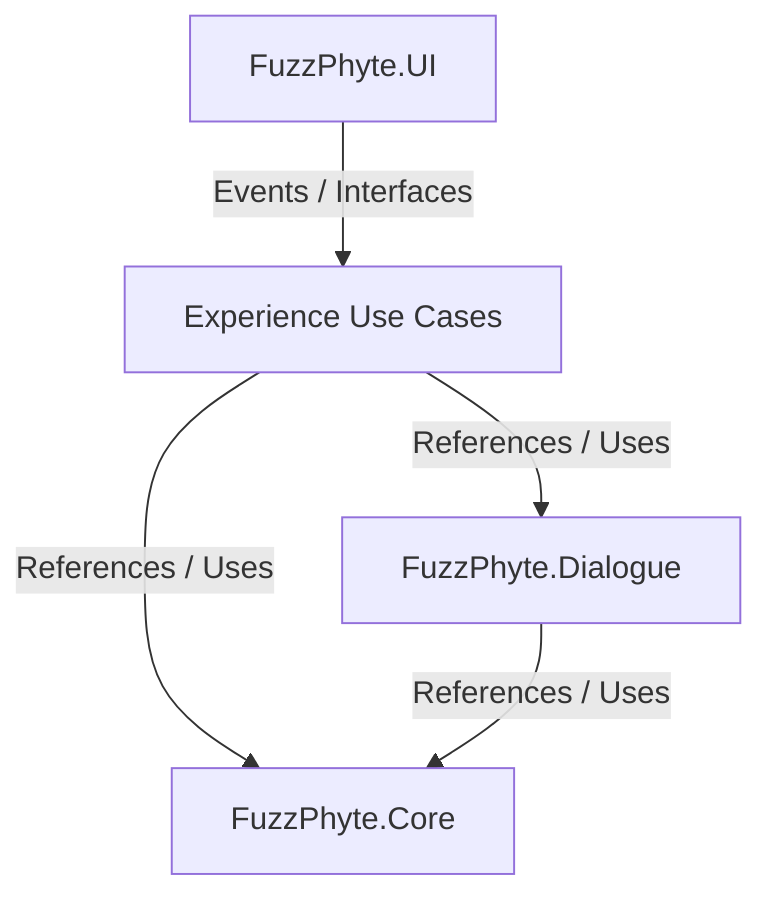

# FuzzPhyte Unity Tools

## User Interface

FP_UI is designed to be a core base class for future UI related work towards Unity's UI Toolkit, UI Elements, and UnityEngine.UI... this package is under development and will drastically change over the 2025 year. Currently this is just one core base class with useful styles and methods for activating/deactivating styles

## Setup & Design

FP_UI is just a base class to be derived from other UI Toolkit classes.

### Software Architecture

## FuzzPhyte Package Dependency Flow

```mermaid
graph TD
    %% High-Level UI Package
    UI[FuzzPhyte.UI] -->|Events / Interfaces| UseCases[Experience Use Cases]

    %% Experience Logic & Use Cases
    UseCases -->|References / Uses| Core[FuzzPhyte.Core]
    UseCases -->|References / Uses| Dialogue[FuzzPhyte.Dialogue]

    %% Example Dialogue Package
    Dialogue -->|References / Uses| Core

    %% Core Utilities (Lowest-Level)
    Core

    %% No direct dependency lines from UI downwards
```

### Ways to Extend

Please see the [contributing](./CONTRIBUTING.md) file for more information.

## Dependencies

Please see the [package.json](./package.json) file for more information.

## License Notes

See [LICENSE.md](LICENSE.md) for details

## Contact

* [John Shull](mailto:JShull@fuzzphyte.com)
